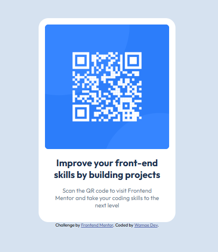

# Frontend Mentor - QR code component solution

This is a solution to the [QR code component challenge on Frontend Mentor](https://www.frontendmentor.io/challenges/qr-code-component-iux_sIO_H). Frontend Mentor challenges help you improve your coding skills by building realistic projects. 

## Table of contents

- [Overview](#overview)
  - [Screenshot](#screenshot)
  - [Links](#links)
- [My process](#my-process)
  - [Built with](#built-with)
  - [What I learned](#what-i-learned)
  - [Continued development](#continued-development)
  - [Useful resources](#useful-resources)
- [Author](#author)
- [Acknowledgments](#acknowledgments)

**Note: Delete this note and update the table of contents based on what sections you keep.**

## Overview

### Screenshot

### Links

- Solution URL: [Add solution URL here](https://your-solution-url.com)
- Live Site URL: [Add live site URL here](https://qr-code-component-ten-flame.vercel.app/)

## My process

### Built with

- Semantic HTML5 markup
- CSS custom properties
- Mobile-first workflow 

### What I learned

- While working on this project, I reinforced the importance of:

- Structuring HTML semantically for accessibility.

- Using Flexbox for alignment and centering content.

- Keeping CSS styles simple and scalable with variables.

### Continued development

- For future projects, I’d like to:

- Experiment with CSS Grid alongside Flexbox.

- Add hover animations for better interactivity.

- Explore component reusability with React.

### Useful resources

- CSS Tricks – A Complete Guide to Flexbox

- MDN Web Docs for quick reference.

## Author

- Website - [Presbury Wamae](https://www.your-site.com)
- Frontend Mentor - [@wamaedev](https://www.frontendmentor.io/profile/yourusername)

